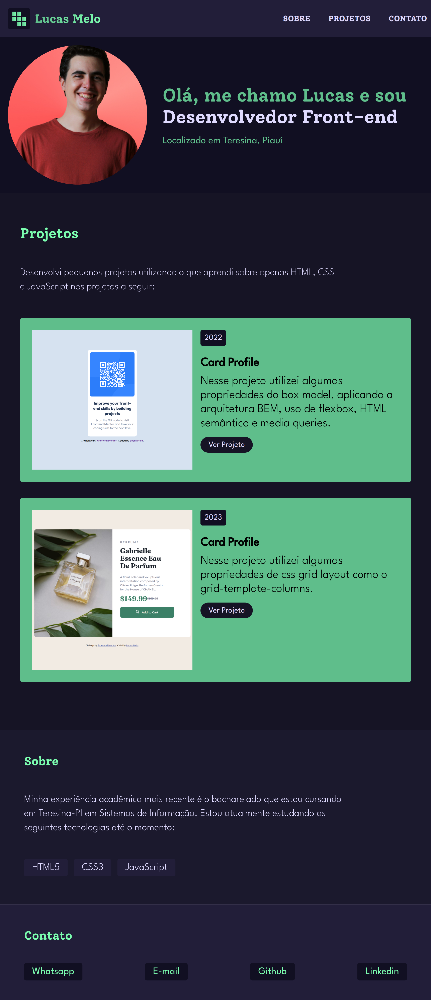

# Portfólio

Esse é o projeto [Portfólio](https://lucasmeloc.github.io/portfolio/).

## Sumário dos Conteúdos

- [Screenshot](###screenshot)
- [Criei utilizando](###criei-utilizando)
- [O que eu aprendi?](###o-que-eu-aprendi)
- [Continuar aprimorando conhecimentos](###continuar-aprimorando-os-conhecimentos)
- [Recursos utilitários](###recursos-utilitarios)
- [Autor](#autor)

### Screenshot

### Criei utilizando

- Semantic HTML5 markup
- CSS Box model
- Flexbox
- Media queries
- BEM (Bloco, Elemento, Modificador)

### O que eu aprendi

I aprendi a utilizar algumas das propriedades de css flexbox para complementar com a responsividade da página assim como também incluir propriedades de box model no projeto.

### Continuar aprimorando os conhecimentos

Eu pretendo aprender mais. Aqui está uma lista do que eu pretendo aprender para ir complemento futuramente mais ainda em meus projetos:

- Formulários
- Sass
- JavaScript

### Recursos Utilitários

- [Guia sobre flexbox](https://origamid.com/projetos/flexbox-guia-completo/) - Esse guia me ajudou a compreender como aplicar as propriedades flexbox com mais facilidade.

## Autor

- Website - [Lucas Melo](https://lucasmeloc.github.io/portfolio)
- Linkedin - [Linkedin](https://www.linkedin.com/in/lucasmeloc)
